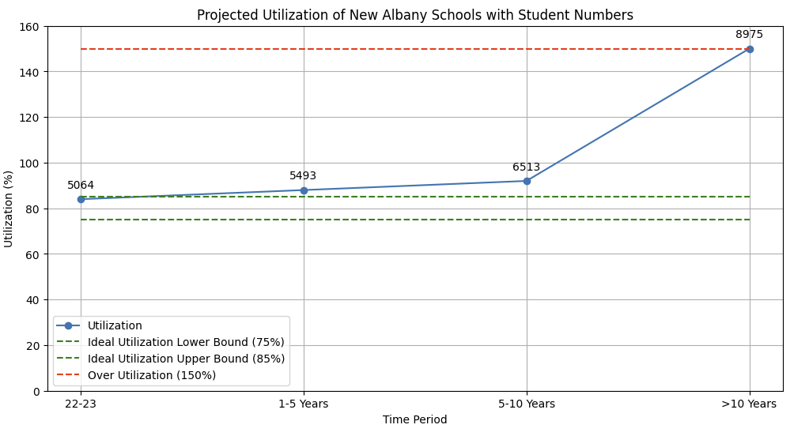
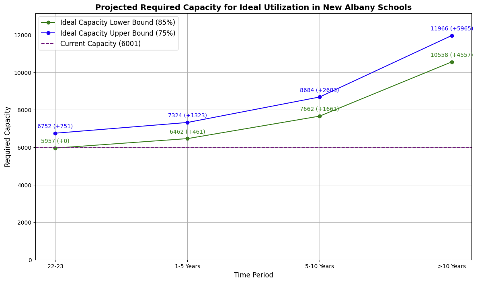
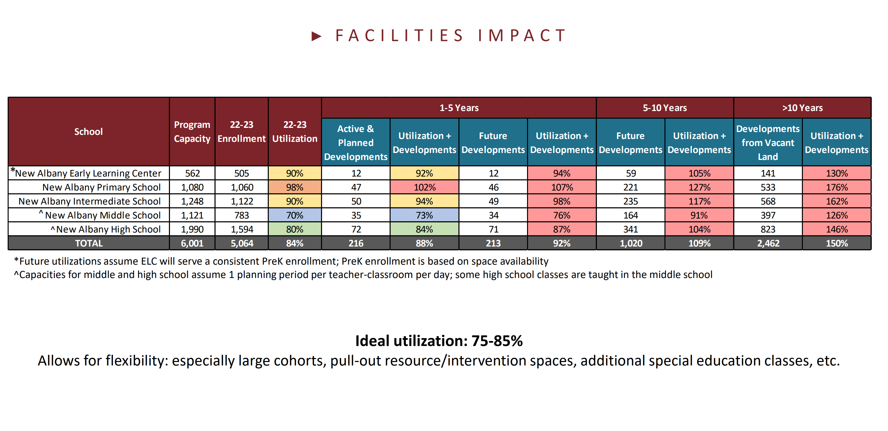

# New Albany Schools Utilization Study

This repository contains data and visualizations related to the projected utilization and capacity requirements for New Albany Schools. The study aims to analyze current enrollment, future developments, and the required capacity to maintain ideal utilization rates over different time periods.

## Contents

- `projected_utilization.png`: A graph depicting the projected utilization of New Albany Schools over the next several years, taking into account current enrollment and planned future developments.
- `projected_required_capacity_ideal.png`: A graph showing the projected required capacity for ideal utilization in New Albany Schools. This visualization includes both the lower and upper bounds of ideal capacity and highlights the additional capacity needed.
- `napls_study_data.png`: A summary image of the data used in the study, showing the program capacity, current enrollment, and utilization rates for different school levels within the district.

## Visualizations

### Projected Utilization



This graph illustrates the projected utilization rates of New Albany Schools over various time periods. The data takes into account current enrollment, active and planned developments, and future developments to estimate how utilization rates will change.

### Projected Required Capacity for Ideal Utilization



This visualization shows the required capacity for New Albany Schools to achieve ideal utilization rates. The green and blue lines represent the lower and upper bounds of ideal capacity (85% and 75% utilization rates, respectively). The purple dashed line represents the current capacity of the schools. The annotations indicate the required capacity and the additional capacity needed in parentheses.

### NAPLS Study Data



This image provides a summary of the data used in the study. It includes details on program capacity, current enrollment, and utilization rates for different school levels, along with projections for active and planned developments.

## How to Use

1. Clone the repository:
   ```bash
   git clone https://github.com/yourusername/napls-utilization-study.git
   ```
1. Navigate to the project directory: `cd napls-utilization-study`

## Contributing
Contributions are welcome! If you have any suggestions or improvements, feel free to create a pull request or open an issue.

## License
This project is licensed under the MIT License. See the LICENSE file for details.

